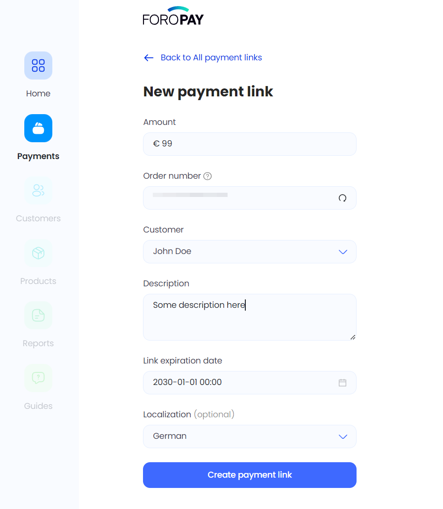

# Payment Links overview

> Embed or share a link to the [ForoPay Hosted checkout page](/docs-portal/getting_started/online_payments/hosted_checkout_page), to start accepting payments anytime, anywhere.

Payment links are a quick and simple way to accept payments from your customers wherever they are. Just share a unique link and your customer will be directed to our secure checkout page to complete payment. You can start selling online without the need for a website. No code. No fuss.

You can create a payment link via [ForoPay dashboard portal](https://dashboard.foropay.eu/) or directly via the ForoPay API. ForoPay dashboard portal is easy - no code required; simply generate a new link each time you wish to create an order. When using the API, you can automate the process, but you will need a developer.

:::info

You can control **expire date** of payment link or **deactivate** via user interface

:::

This solution is PCI compliant. You don't have to worry about payment security.